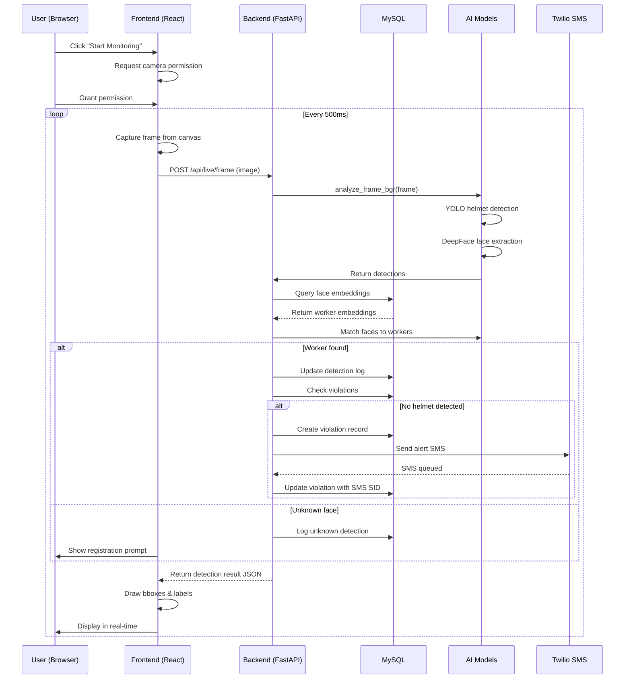
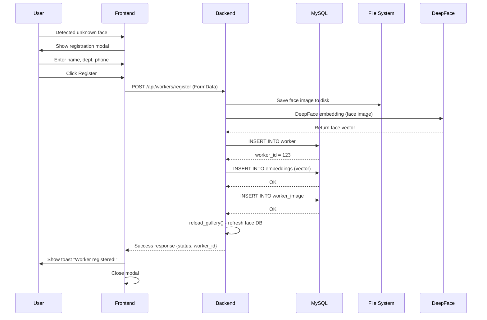

# VINIMI Project Architecture & Workflow Diagrams

## System Overview

**VINIMI** is an AI-powered workplace safety monitoring system with real-time face detection, worker recognition, and safety violation tracking. The architecture consists of three main layers:

1. **Frontend** (React + Vite)
2. **Backend** (FastAPI)
3. **Database** (MySQL)
4. **AI/ML Models** (YOLO, DeepFace)

---

## High-Level System Architecture

```
┌─────────────────────────────────────────────────────────────────────────────┐
│                          CLIENT BROWSER (React/Vite)                        │
├─────────────────────────────────────────────────────────────────────────────┤
│  Home | Dashboard | Workers | Live Monitoring | Violations | Recent Alerts │
│                                                                              │
│  ├── Authentication (Login/Signup)                                          │
│  ├── Real-time Camera Feed Streaming                                       │
│  ├── Worker Management & Details                                           │
│  ├── Violation History & Reports                                           │
│  └── Settings & Profile Management                                         │
└──────────────────────────────────┬──────────────────────────────────────────┘
                                   │
                    HTTP/REST API + WebSocket
                         (Port 8001)
                                   │
         ┌─────────────────────────┴──────────────────────────┐
         │                                                     │
┌────────▼────────────────────────────────────────┐   ┌──────▼──────────┐
│         FastAPI Backend (uvicorn)               │   │   Static Files  │
│                                                 │   │   (/media/...)  │
│  ┌────────────────────────────────────────┐    │   └─────────────────┘
│  │ Core API Endpoints                     │    │
│  │ ├── /auth/* (signup, login)            │    │
│  │ ├── /api/workers/* (CRUD)              │    │
│  │ ├── /api/live/* (live frame process)   │    │
│  │ ├── /api/detect/* (face detection)     │    │
│  │ ├── /api/violations (list violations)  │    │
│  │ ├── /api/alerts/* (SMS alerts)         │    │
│  │ └── /api/logs/* (log streaming)        │    │
│  └────────────────────────────────────────┘    │
│                                                 │
│  ┌────────────────────────────────────────┐    │
│  │ AI/ML Services                         │    │
│  │ ├── YOLO v8 (Helmet Detection)         │    │
│  │ ├── DeepFace (Face Recognition)        │    │
│  │ └── Face Gallery (Vector Search)       │    │
│  └────────────────────────────────────────┘    │
│                                                 │
│  ┌────────────────────────────────────────┐    │
│  │ Background Tasks                       │    │
│  │ ├── SMS Alert Sending (Twilio)         │    │
│  │ ├── Violation Recording                │    │
│  │ ├── Frame Logging                      │    │
│  │ └── Image Saving                       │    │
│  └────────────────────────────────────────┘    │
└────────────────────┬───────────────────────────┘
                     │
       MySQL Connection (Port 3306)
                     │
         ┌───────────▼───────────┐
         │   MySQL Database      │
         │  (vinimi_local)       │
         │                       │
         │  Tables:              │
         │  ├── company          │
         │  ├── location         │
         │  ├── manager          │
         │  ├── worker           │
         │  ├── embeddings       │
         │  ├── worker_image     │
         │  ├── violation        │
         │  └── alerts           │
         └───────────────────────┘
```

---

## Frontend Architecture (React + Vite)

```
src/
├── pages/
│   ├── Home.tsx                    # Landing page, marketing
│   ├── Login.tsx                   # Authentication
│   ├── Signup.tsx                  # Registration
│   ├── Dashboard.tsx               # Overview & KPIs
│   ├── Workers.tsx                 # Worker list with cards
│   ├── WorkerDetail.tsx            # Single worker details
│   ├── LiveMonitoring.tsx          # Real-time camera feed
│   ├── Violations.tsx              # Violation history table
│   ├── RecentAlerts.tsx            # Recent SMS alerts
│   ├── Account.tsx                 # User profile
│   ├── AskVLM.tsx                  # AI Q&A (optional)
│   └── NotFound.tsx                # 404 page
│
├── components/
│   ├── AppBar.tsx                  # Header with navigation
│   ├── Sidebar.tsx                 # Navigation sidebar
│   ├── DashboardLayout.tsx         # Layout wrapper
│   ├── ProtectedRoute.tsx          # Auth guard wrapper
│   ├── home/                       # Landing page sections
│   │   ├── Hero.tsx
│   │   ├── Features.tsx
│   │   ├── KPIs.tsx
│   │   ├── HowItWorks.tsx
│   │   ├── UseCases.tsx
│   │   ├── SocialProof.tsx
│   │   └── FinalCTA.tsx
│   └── ui/                         # Reusable UI components
│       ├── button.tsx
│       ├── card.tsx
│       ├── dialog.tsx
│       ├── input.tsx
│       ├── toast.tsx
│       └── ... (shadcn/ui library)
│
├── lib/
│   ├── api.ts                      # API client & endpoints
│   ├── auth.ts                     # Auth logic (localStorage)
│   └── utils.ts                    # Utility functions
│
├── hooks/
│   ├── use-mobile.tsx              # Responsive hook
│   ├── use-toast.ts                # Toast notifications
│   └── useSidebar.ts               # Sidebar state
│
├── App.tsx                         # Main app component (Router setup)
├── main.tsx                        # React entry point
└── index.css                       # Tailwind CSS
```

### Frontend Data Flow

```
User Action (click, input)
        │
        ▼
Component Event Handler
        │
        ▼
   lib/api.ts (apiFetch)
        │
   ┌────┴────┐
   ▼         ▼
GET/POST   Set State (React)
   │         │
   ▼         ▼
Backend API  UI Update
   │
   ▼
Component Re-render
   │
   ▼
Display Result (Card, Toast, etc.)
```

---

## Backend Architecture (FastAPI)

```
vinimi_live/
├── app/
│   ├── main.py                  # FastAPI app + all routes
│   ├── config.py                # Pydantic settings
│   ├── db.py                    # MySQL connection & queries
│   ├── detection.py             # YOLO + DeepFace inference
│   ├── face_gallery.py          # Face embedding search
│   ├── alerts.py                # Twilio SMS & violation logic
│   ├── worker_utils.py          # Worker helper functions
│   ├── inspect_gcp_db.py        # GCP inspection (optional)
│   ├── __init__.py
│   └── live.html                # Live monitoring HTML template
│
├── requirements.txt             # Python dependencies
├── vinimi_live_still.py         # Standalone detection script
├── embeddings_with_vectors.csv  # Pre-computed face embeddings
├── vinimi_local_schema.sql      # MySQL schema
├── logs/                        # Live event logs (rolling)
└── worker_images/               # Worker face images
    ├── violations/
    ├── worker_17/
    └── worker_18/
```

### Backend API Endpoints

```
Authentication
  POST /auth/signup              - Register new manager
  POST /auth/login               - Manager login
  POST /auth/logout              - Logout

Worker Management
  GET  /api/workers              - List all workers
  GET  /api/workers/{id}         - Get worker details
  POST /api/workers/register     - Register new worker (with face)
  GET  /api/workers/{id}/media   - Get worker images
  GET  /api/workers/{id}/violations - Get worker violations

Face Detection & Analysis
  POST /api/detect/frame         - Single frame detection
  POST /api/live/frame           - Live stream frame processing
  GET  /api/live/recent-alerts   - Get recent alerts

Violations & Alerts
  GET  /api/violations           - List all violations
  POST /api/alerts/test          - Send test SMS alert
  GET  /api/alerts/summary       - Alert summary

Logs & Downloads
  GET  /api/logs/list            - List log files
  GET  /api/logs/tail            - Tail last N lines of log
  GET  /api/logs/today           - Today's log text
  GET  /api/logs/today.pdf       - Today's log as PDF
  GET  /api/logs/download        - Download log as CSV/JSON

Manager Profile
  GET  /api/manager/{id}         - Get manager info
  PUT  /api/manager/{id}         - Update manager

Health & Status
  GET  /health                   - Health check
```

---

## Database Schema

```
┌─────────────────────────────────────────────────────────┐
│                        company                          │
├─────────────────────────────────────────────────────────┤
│ id (PK) | name | created_at                             │
│ 1       | NextGen Construct                             │
│ 2       | SecureWorks Solutions                         │
│ 3       | Vanguard Infra Pvt Ltd                        │
└──────────────┬──────────────────────────────────────────┘
               │
    ┌──────────┴───────────────┐
    │                          │
    ▼                          ▼
┌──────────────────┐   ┌───────────────────┐
│    location      │   │     manager       │
├──────────────────┤   ├───────────────────┤
│ id (PK)          │   │ id (PK)           │
│ company_id (FK)  │   │ email             │
│ name             │   │ name              │
│ address          │   │ company_id (FK)   │
│ created_at       │   │ password_hash     │
└────────┬─────────┘   │ created_at        │
         │             └───────────────────┘
         │
    ┌────▼──────────┐
    │               │
    ▼               ▼
┌──────────────────────────────────────────┐
│            worker                        │
├──────────────────────────────────────────┤
│ id (PK) | name | company_id (FK)        │
│ location_id (FK) | phone                │
│ department | shift | created_at         │
└────┬────────────────────────┬───────────┘
     │                        │
     │                    ┌───▼────────────┐
     │                    │ worker_image   │
     │                    ├────────────────┤
     │                    │ id (PK)        │
     │                    │ worker_id (FK) │
     │                    │ path           │
     │                    │ captured_at    │
     │                    └────────────────┘
     │
     ▼
┌──────────────────────────────────────────────────┐
│            embeddings                            │
├──────────────────────────────────────────────────┤
│ id (PK) | filename | worker_id (FK)             │
│ name | company_id | location_id                 │
│ embedding (LONGTEXT - JSON vector)              │
│ capture_datetime                                │
└──────────────────────────────────────────────────┘

┌──────────────────────────────────────────────────┐
│            violation                             │
├──────────────────────────────────────────────────┤
│ id (PK) | worker_id (FK) | timestamp            │
│ location_id | helmet_on | is_unknown            │
│ similarity_score | image_path                   │
│ sms_sid | sms_status | details (JSON)           │
│ created_at                                      │
└──────────────────────────────────────────────────┘
```

---

## Key Workflows

### 1. Live Monitoring Workflow

```
┌─────────────────────────────────────────────────────────────────┐
│ Browser: LiveMonitoring.tsx                                    │
│ ├── requestVideoPermission()                                   │
│ └── startLiveStream()                                          │
└──────────────────────────┬──────────────────────────────────────┘
                           │
                    ┌──────▼──────┐
                    │ Canvas API  │
                    │ getImageData│
                    └──────┬──────┘
                           │
          ┌────────────────▼────────────────┐
          │ Every 500ms capture frame       │
          │ Convert to Blob                 │
          └────────────────┬────────────────┘
                           │
              ┌────────────▼────────────┐
              │ POST /api/live/frame    │
              │ (FormData: file upload) │
              └────────────┬────────────┘
                           │
         ┌─────────────────▼──────────────────┐
         │  Backend: live_frame() endpoint    │
         │                                    │
         │  1. Read frame bytes               │
         │  2. Decode to OpenCV Mat (BGR)     │
         │  3. analyze_frame_bgr()            │
         └────────┬─────────────────────────┬─┘
                  │                         │
        ┌─────────▼──────────┐    ┌────────▼────────┐
        │ YOLO v8 Detection  │    │  DeepFace Embed │
        │                    │    │                 │
        │ ├─ Helmets        │    │ ├─ Extract faces│
        │ ├─ Bboxes        │    │ ├─ Compute vec  │
        │ └─ Confidence    │    │ └─ Search DB    │
        └────────┬──────────┘    └────────┬────────┘
                 │                        │
                 └────────────┬───────────┘
                              │
                ┌─────────────▼─────────────┐
                │ Match Against Gallery     │
                │                           │
                │ If worker found:          │
                │ - Record detection       │
                │ - Log event              │
                │ - Check helmet status    │
                │                           │
                │ If unknown:               │
                │ - Mark as suspicious     │
                │ - Request registration   │
                └────────────┬──────────────┘
                             │
              ┌──────────────▼──────────────┐
              │ Violation Check             │
              │                             │
              │ If no helmet detected:      │
              │ - Create violation record  │
              │ - Send SMS alert (async)   │
              │ - Save frame snapshot      │
              │ - Add to recent alerts     │
              └────────────┬────────────────┘
                           │
            ┌──────────────▼──────────────┐
            │ Return Result JSON to UI    │
            │                             │
            │ {                           │
            │   detections: [...]         │
            │   worker_matches: [...]     │
            │   violations: [...]         │
            │   timestamp: ...            │
            │ }                           │
            └──────────────┬──────────────┘
                           │
          ┌────────────────▼────────────────┐
          │ Browser Updates UI              │
          │                                 │
          │ ├─ Draw bboxes on canvas      │
          │ ├─ Display worker names       │
          │ ├─ Highlight violations       │
          │ ├─ Show recent alerts toast   │
          │ └─ Update statistics          │
          └────────────────────────────────┘
```

### 2. Worker Registration Workflow

```
┌──────────────────────────────────────────────┐
│ Frontend: LiveMonitoring.tsx                 │
│ Unknown face detected                        │
│ User clicks "Register Worker"                │
└──────────────────────┬───────────────────────┘
                       │
        ┌──────────────▼──────────────┐
        │ Show Registration Modal      │
        │                              │
        │ Form fields:                 │
        │ ├─ Name (text)              │
        │ ├─ Employee ID (text)       │
        │ ├─ Department (select)      │
        │ ├─ Phone (tel)              │
        │ ├─ Helmet On? (checkbox)    │
        │ └─ Face Image (captured)    │
        └──────────────┬──────────────┘
                       │
        ┌──────────────▼──────────────┐
        │ User submits form           │
        │ (FormData with face image)  │
        └──────────────┬──────────────┘
                       │
        ┌──────────────▼──────────────────────┐
        │ POST /api/workers/register          │
        │ - face: UploadFile                  │
        │ - name: str                         │
        │ - phone: str                        │
        │ - company_id: int                   │
        │ - location_id: int                  │
        │ - helmet_on: bool                   │
        └──────────────┬───────────────────────┘
                       │
    ┌──────────────────▼────────────────────────────┐
    │ Backend: register_worker() endpoint          │
    │                                              │
    │ 1. Validate inputs                          │
    │ 2. Save face image to disk                  │
    │ 3. Compute face embedding (DeepFace)        │
    │ 4. Insert worker record → worker table      │
    │ 5. Insert embedding record → embeddings     │
    │ 6. Insert worker_image record               │
    │ 7. reload_gallery() - refresh face DB       │
    └──────────────┬────────────────────────────────┘
                   │
    ┌──────────────▼────────────────────────────────┐
    │ Return success response                      │
    │ {                                            │
    │   status: "ok",                              │
    │   worker_id: 123,                            │
    │   message: "Registered worker John Doe..."   │
    │ }                                            │
    └──────────────┬────────────────────────────────┘
                   │
    ┌──────────────▼────────────────────┐
    │ Frontend: Close modal, show toast  │
    │ "Worker registered successfully!" │
    │ Gallery auto-refreshes next frame │
    └────────────────────────────────────┘
```

### 3. SMS Alert Workflow (Helmet Violation)

```
┌────────────────────────────────────┐
│ Frame detection shows:             │
│ - Worker recognized               │
│ - NO helmet detected               │
│ - Confidence > threshold           │
└──────────────┬─────────────────────┘
               │
    ┌──────────▼──────────┐
    │ schedule_helmet_alert │
    │ (background task)    │
    └──────────┬──────────┘
               │
    ┌──────────▼──────────────────────────┐
    │ 1. Save violation snapshot          │
    │    (frame_bgr → worker_17/img.jpg)  │
    │                                      │
    │ 2. Create violation record in DB    │
    │    - worker_id, timestamp, location │
    │    - helmet_on = false              │
    │    - image_path, sms_status         │
    │                                      │
    │ 3. Check alert cooldown (THROTTLE)  │
    │    Last alert for this worker?      │
    │    If < 15 mins ago, skip SMS      │
    └──────────┬──────────────────────────┘
               │
        ┌──────▼──────────────┐
        │ Cooldown passed?    │
        └──┬─────────┬─────────┘
           │ YES     │ NO
           ▼         │
    ┌────────────────────┐   ├─ Log event
    │ Send SMS via Twilio│   └─ Return
    │                    │
    │ 1. Get phone num   │
    │ 2. Compose message │
    │    "Alert: John    │
    │     Doe no helmet" │
    │ 3. send_sms()      │
    │ 4. Get SMS SID,    │
    │    status (queued) │
    └────────┬───────────┘
             │
    ┌────────▼──────────────────┐
    │ Update violation record   │
    │ - sms_sid = "SM..."       │
    │ - sms_status = "queued"   │
    │                            │
    │ Log event:                │
    │ {                          │
    │   "ts": "2025-11-26T...", │
    │   "name": "John Doe",     │
    │   "worker_id": 5,         │
    │   "helmet_on": false,     │
    │   "sms_sent": true        │
    │ }                          │
    └────────┬──────────────────┘
             │
    ┌────────▼──────────────────┐
    │ Add to recent_alerts cache│
    │ (in-memory + file-backed) │
    └────────┬──────────────────┘
             │
    ┌────────▼──────────────────────────┐
    │ Frontend: Show toast               │
    │ "Alert sent to manager"            │
    │                                     │
    │ Manager receives SMS on phone      │
    │ "VINIMI: John Doe - No helmet"    │
    └────────────────────────────────────┘
```

### 4. Dashboard / Workers List Workflow

```
┌──────────────────────────────────────┐
│ Browser: Workers.tsx loads           │
│ useEffect → fetchWorkers()           │
└──────────────┬───────────────────────┘
               │
      ┌────────▼──────────────┐
      │ GET /api/workers      │
      └────────┬──────────────┘
               │
      ┌────────▼───────────────────────┐
      │ Backend: list_workers()         │
      │                                 │
      │ 1. Query all workers from DB    │
      │ 2. For each worker:             │
      │    - Fetch latest images        │
      │    - Fetch violations (count)   │
      │    - Get location name          │
      │    - Build response object      │
      │                                 │
      │ 3. Return array of WorkerApi    │
      │    [                            │
      │      {                          │
      │        id, name, department,    │
      │        location_name,           │
      │        phone,                   │
      │        images: [...],           │
      │        violations: [count]      │
      │      },                         │
      │      ...                        │
      │    ]                            │
      └────────┬───────────────────────┘
               │
      ┌────────▼──────────────────┐
      │ Frontend: setWorkers([...])│
      │ Component re-renders       │
      └────────┬──────────────────┘
               │
      ┌────────▼──────────────────────┐
      │ Render worker cards           │
      │                                │
      │ For each worker:              │
      │ ├─ Show avatar (latest image)│
      │ ├─ Name, Department          │
      │ ├─ Location, Phone           │
      │ ├─ Violations badge (count)  │
      │ └─ Click to view details     │
      └────────────────────────────────┘
```

---

## Mermaid Sequence Diagrams

### Face Detection & Alert Sequence



### Worker Registration Sequence



---

## Technology Stack

### Frontend
- **Framework**: React 18 + TypeScript
- **Bundler**: Vite
- **UI Library**: shadcn/ui (Tailwind CSS)
- **State Management**: React hooks + localStorage
- **HTTP Client**: Fetch API
- **Icons**: lucide-react

### Backend
- **Framework**: FastAPI (Python)
- **Server**: Uvicorn (ASGI)
- **ORM**: MySQL connector (direct queries)
- **AI/ML**:
  - YOLO v8 (object detection)
  - DeepFace (face recognition)
  - OpenCV (image processing)
- **External Services**: Twilio (SMS alerts)
- **Async**: Background tasks, threading
- **PDF Generation**: reportlab
- **Logging**: JSON-based file logs

### Database
- **Engine**: MySQL 8.x
- **Character Set**: utf8mb4 (Unicode support)
- **Collation**: utf8mb4_0900_ai_ci
- **Tables**: 8 (company, location, manager, worker, embeddings, worker_image, violation, alerts)

### Infrastructure
- **Development**: Local (macOS/Windows/Linux)
- **Deployment**: Docker-ready (not yet containerized)
- **File Storage**: Local filesystem (worker_images/, logs/, violations/)

---

## Data Entities & Relationships

### Core Entities

| Entity | Purpose | Key Fields |
|--------|---------|-----------|
| **company** | Organization record | id, name, created_at |
| **location** | Physical workplace location | id, name, company_id, address |
| **manager** | Portal user account | id, email, name, company_id, password_hash |
| **worker** | Employee being monitored | id, name, company_id, location_id, phone, department |
| **embeddings** | Face feature vectors (128-dim) | id, worker_id, embedding (JSON), name, capture_datetime |
| **worker_image** | Captured worker photos | id, worker_id, path, captured_at |
| **violation** | Detected safety violations | id, worker_id, timestamp, helmet_on, is_unknown, image_path, sms_sid, sms_status |
| **alerts** | SMS alert history | id, violation_id, phone, message, status |

### Key Relationships

```
company 1─→ ∞ location
          │
          └─→ ∞ manager
          │
          └─→ ∞ worker

location 1─→ ∞ worker

worker 1─→ ∞ embeddings
        │
        ├─→ ∞ worker_image
        │
        └─→ ∞ violation

violation 1─→ ∞ alerts
```

---

## Performance Considerations

### Frontend Optimization
- **Canvas Capture**: 500ms interval (2 FPS) - balances accuracy vs. latency
- **Lazy Loading**: Pages loaded on-demand
- **Image Caching**: Worker avatars cached in browser
- **React Query**: Optional for data sync

### Backend Optimization
- **Face Gallery**: In-memory cached embeddings for fast lookup (O(1) with vector search)
- **Cooldown Throttling**: SMS alerts limited to 1 per 15 minutes per worker
- **Background Tasks**: Alert sending async (non-blocking)
- **Log Rolling**: Daily log files (prevent unbounded growth)
- **Image Compression**: Violation snapshots saved as JPEG

### Database Optimization
- **Indexes**: Primary keys + unique constraints on critical columns
- **Connection Pooling**: MySQL connector with pooling
- **Query Optimization**: Avoid N+1 queries
- **Embedding Storage**: LONGTEXT for JSON vectors (searchable)

---

## Deployment Workflow (Future)

```
Local Dev → Git Push → GitHub
                          │
                          ▼
                    GitHub Actions (CI)
                    - Run tests
                    - Build Docker image
                    - Push to registry
                          │
                          ▼
                    Kubernetes Cluster
                    - Deploy API pod
                    - Deploy Frontend pod
                    - Attach MySQL volume
                          │
                          ▼
                    Production Server
                    - Nginx reverse proxy
                    - SSL/TLS
                    - Load balancing
```

---

## Security Considerations

1. **Authentication**: Simple email/password (can be enhanced with JWT, OAuth)
2. **CORS**: Currently open (`allow_origins=["*"]`) - should restrict to frontend domain
3. **Secrets**: Twilio credentials in `.env` file (rotate credentials regularly)
4. **Face Data**: Stored embeddings are hashed vectors (not reversible to original face)
5. **SMS Throttling**: Prevents alert spam
6. **Input Validation**: Pydantic models validate all API inputs
7. **Error Handling**: Generic error messages (no information leakage)

---

## Scalability Roadmap

### Phase 1 (Current)
- Single server deployment
- Local MySQL
- In-memory face gallery

### Phase 2 (Growth)
- Multi-server backend (load balanced)
- Redis cache layer (face embeddings)
- Cloud storage (AWS S3) for images

### Phase 3 (Enterprise)
- Kubernetes orchestration
- Database sharding
- Distributed face recognition (edge computing)
- Real-time WebSocket for live alerts
- Message queue (RabbitMQ/Kafka) for event streaming

---

## Summary

VINIMI is a **full-stack AI safety monitoring system** with:
- ✅ Real-time face detection & recognition
- ✅ Helmet compliance checking
- ✅ SMS alert notifications
- ✅ Worker management & registration
- ✅ Violation logging & analytics
- ✅ Responsive web dashboard
- ✅ Extensible API

The architecture is modular, scalable, and ready for enterprise deployment with minimal changes!
