# VINIMI Architecture - Mermaid Diagrams

## System Architecture Diagram

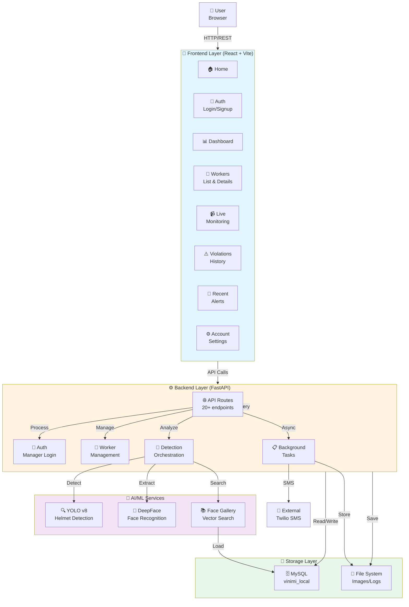

---

## Data Flow Diagram

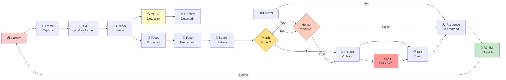

---

## API Endpoint Map

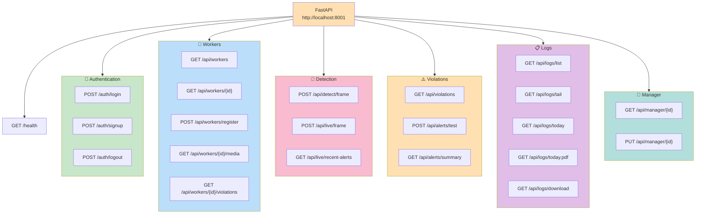

---

## Frontend Page Navigation

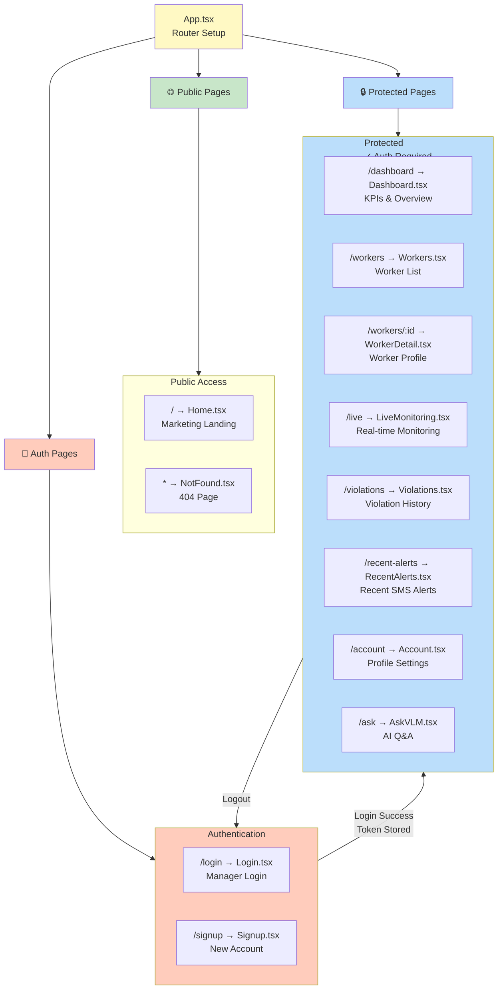

---

## Database Schema Diagram (ER Model)

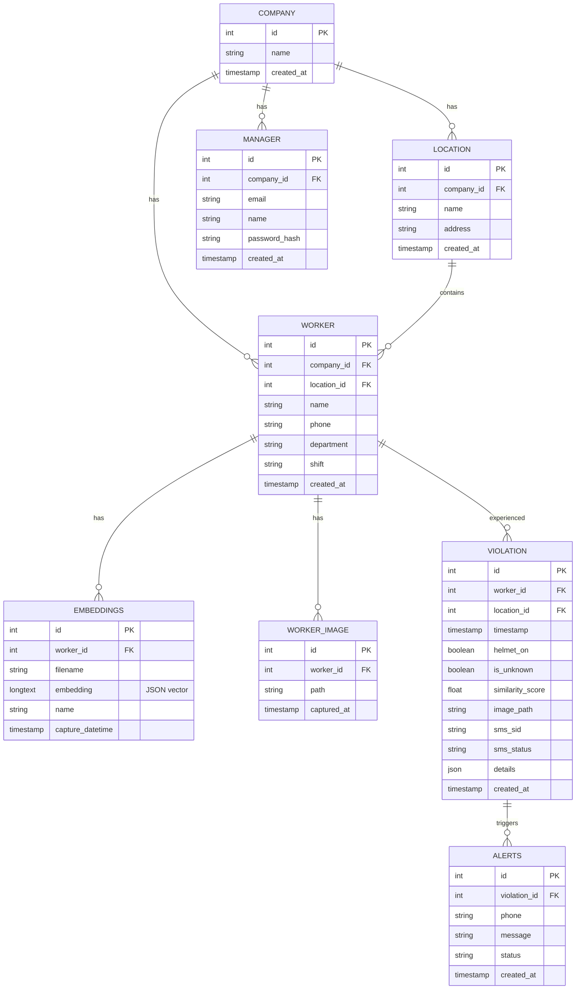

---

## Live Detection Workflow Sequence

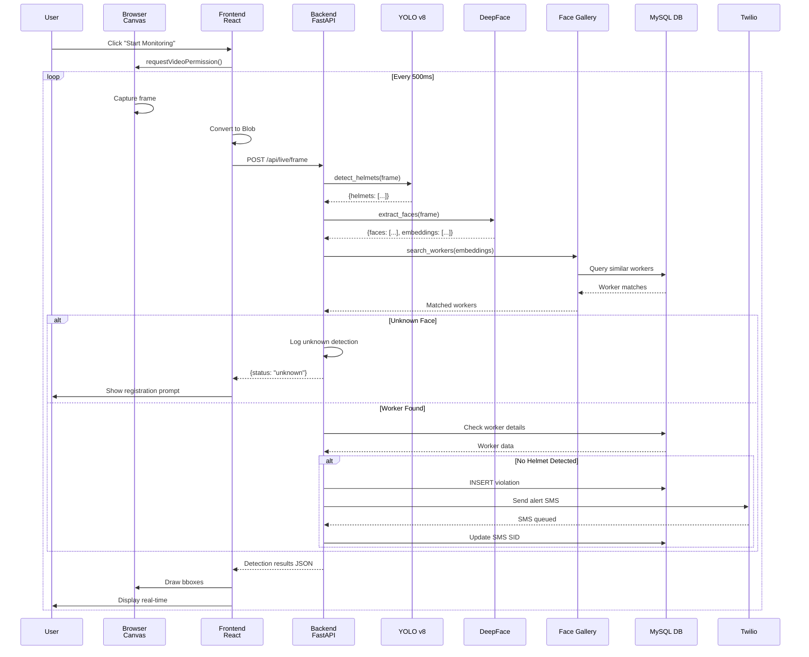

---

## Worker Registration Flow

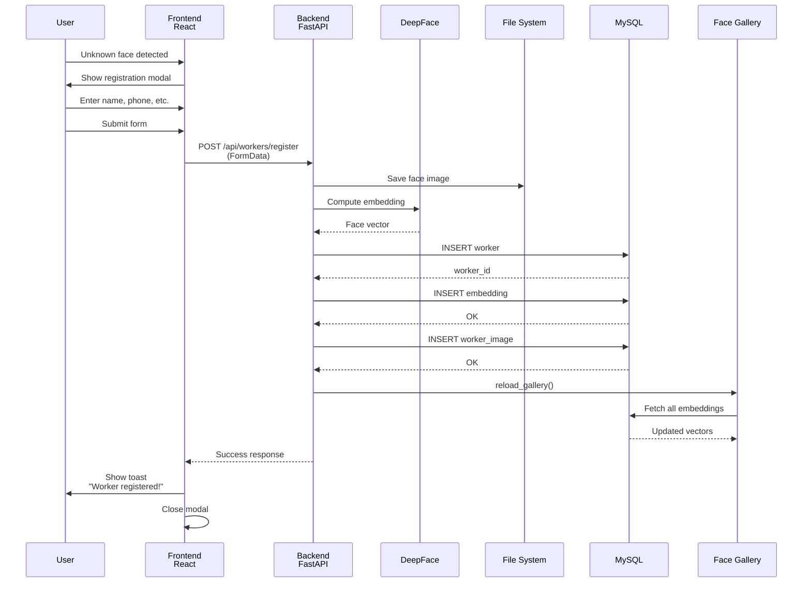

---

## Alert Generation & SMS Flow

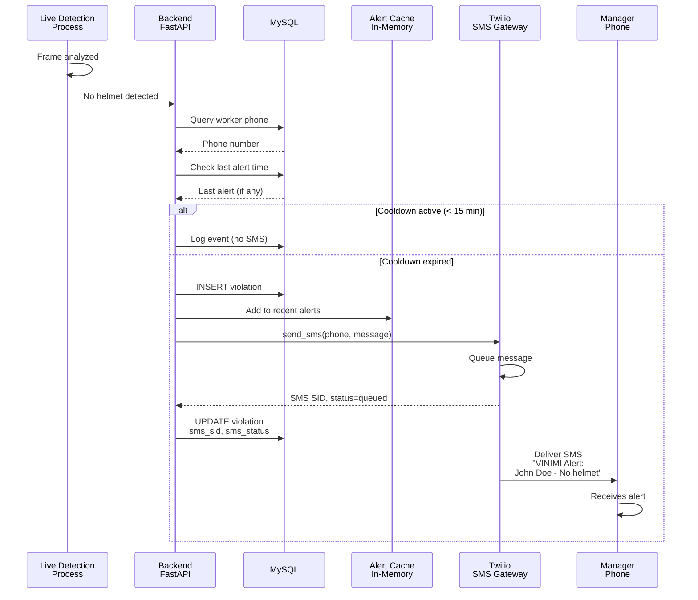

---

## Component Architecture (Frontend)

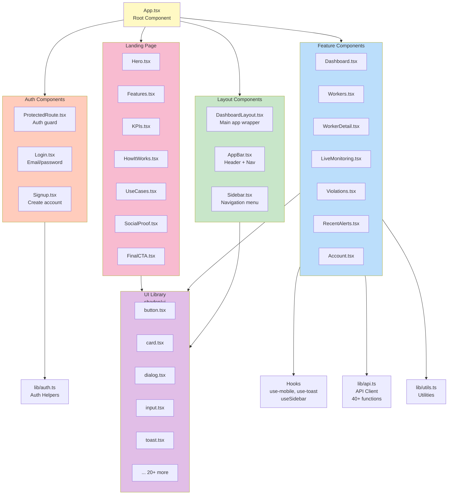

---

## State Management Flow

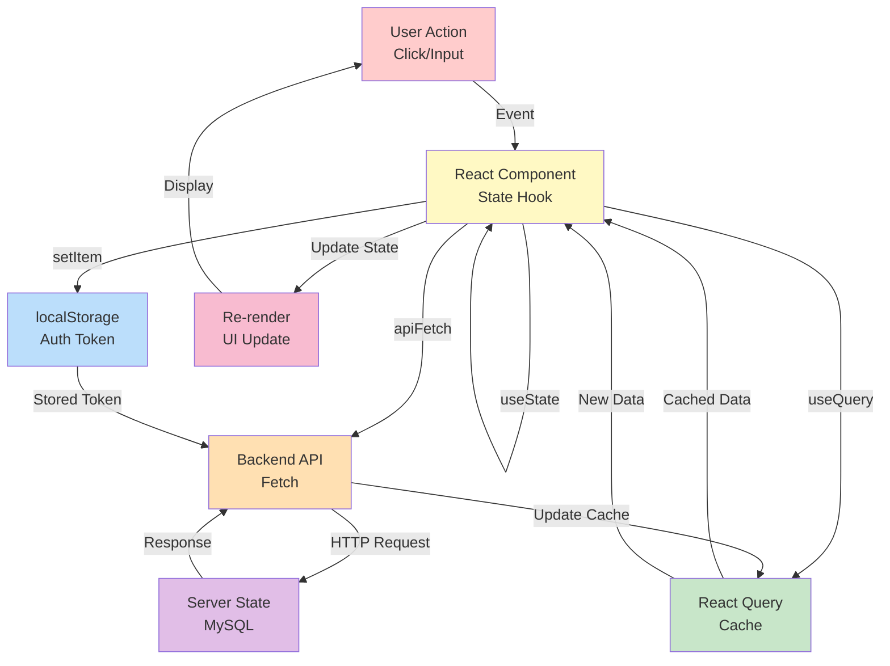

---

## Deployment Architecture (Production Ready)

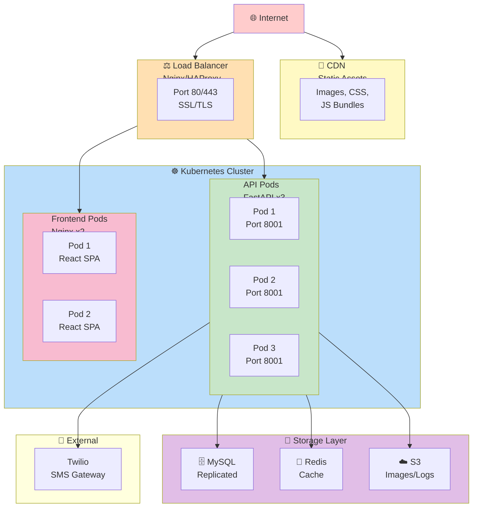

---

## Technology Stack Visualization

```mermaid
graph TB
    subgraph Frontend["FRONTEND<br/>React Stack"]
        React["⚛️ React 18"]
        Vite["⚡ Vite Bundler"]
        TS["📘 TypeScript"]
        Tailwind["🎨 Tailwind CSS"]
        ShadCN["🧩 shadcn/ui"]
        RQ["📊 React Query"]
    end
    
    subgraph Backend["BACKEND<br/>Python Stack"]
        FastAPI["⚙️ FastAPI"]
        Uvicorn["🚀 Uvicorn"]
        Pydantic["✓ Pydantic"]
        YOLO["🔍 YOLO v8"]
        DeepFace["👤 DeepFace"]
        OpenCV["📷 OpenCV"]
        Twilio["📱 Twilio SDK"]
    end
    
    subgraph Database["DATABASE<br/>Data Stack"]
        MySQL["🗄️ MySQL 8.x"]
        Redis["🔴 Redis"]
        CSV["📄 CSV Files"]
        NPY["🔢 NPY Arrays"]
    end
    
    subgraph DevOps["DEVOPS<br/>Infrastructure"]
        Docker["🐳 Docker"]
        K8s["☸️ Kubernetes"]
        GitHub["🐙 GitHub Actions"]
        AWS["☁️ AWS/GCP"]
    end
    
    Frontend --> React
    Frontend --> Vite
    Frontend --> TS
    Frontend --> Tailwind
    Frontend --> ShadCN
    Frontend --> RQ
    
    Backend --> FastAPI
    Backend --> Uvicorn
    Backend --> Pydantic
    Backend --> YOLO
    Backend --> DeepFace
    Backend --> OpenCV
    Backend --> Twilio
    
    Database --> MySQL
    Database --> Redis
    Database --> CSV
    Database --> NPY
    
    DevOps --> Docker
    DevOps --> K8s
    DevOps --> GitHub
    DevOps --> AWS
    
    style Frontend fill:#bbdefb
    style Backend fill:#fff9c4
    style Database fill:#e1bee7
    style DevOps fill:#c8e6c9
```

---

## Performance Monitoring Diagram

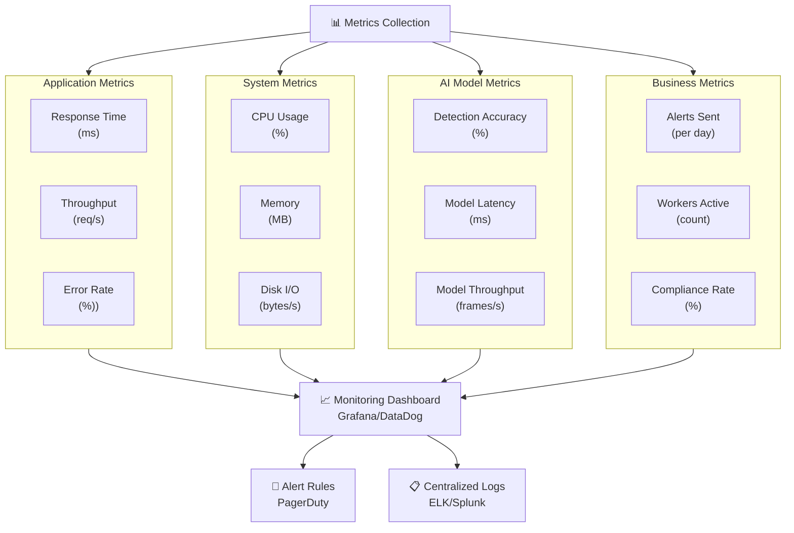

---

## Configuration & Environment Setup

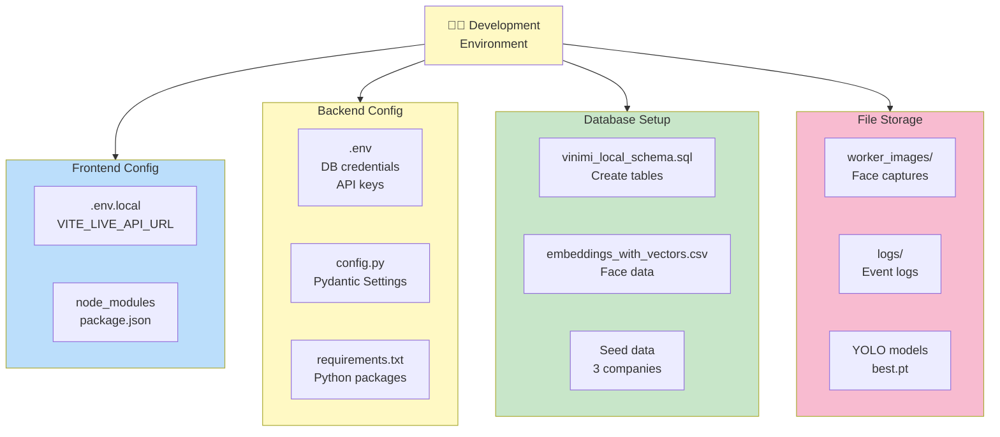

---

## Complete System Interaction Map

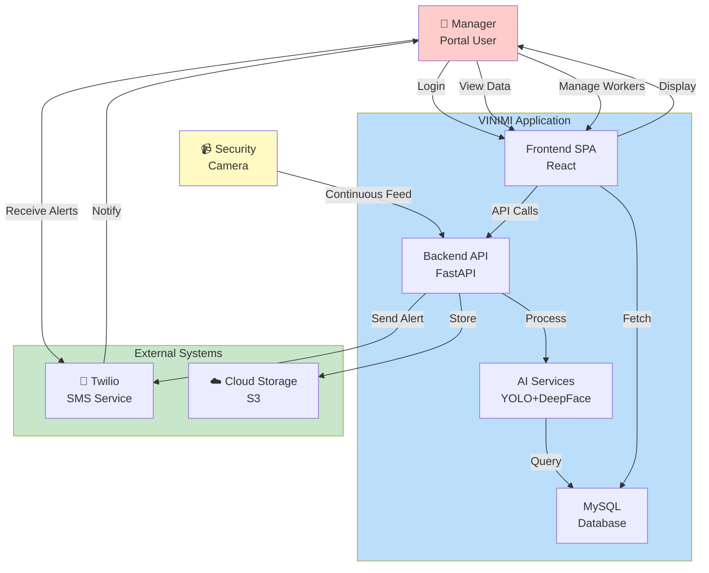
