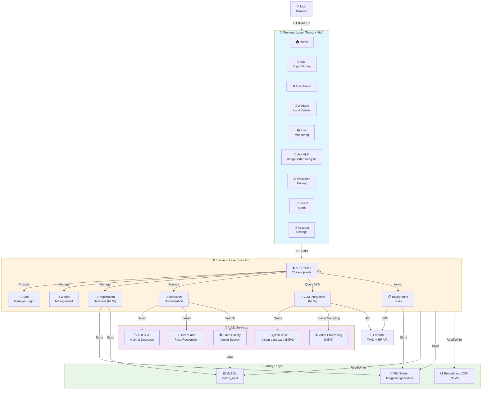
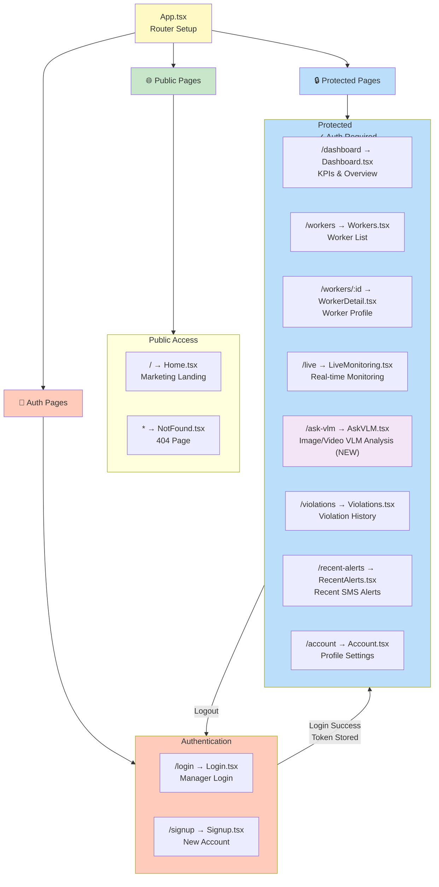
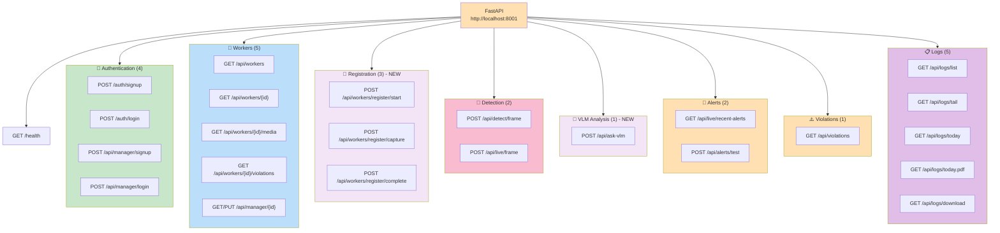
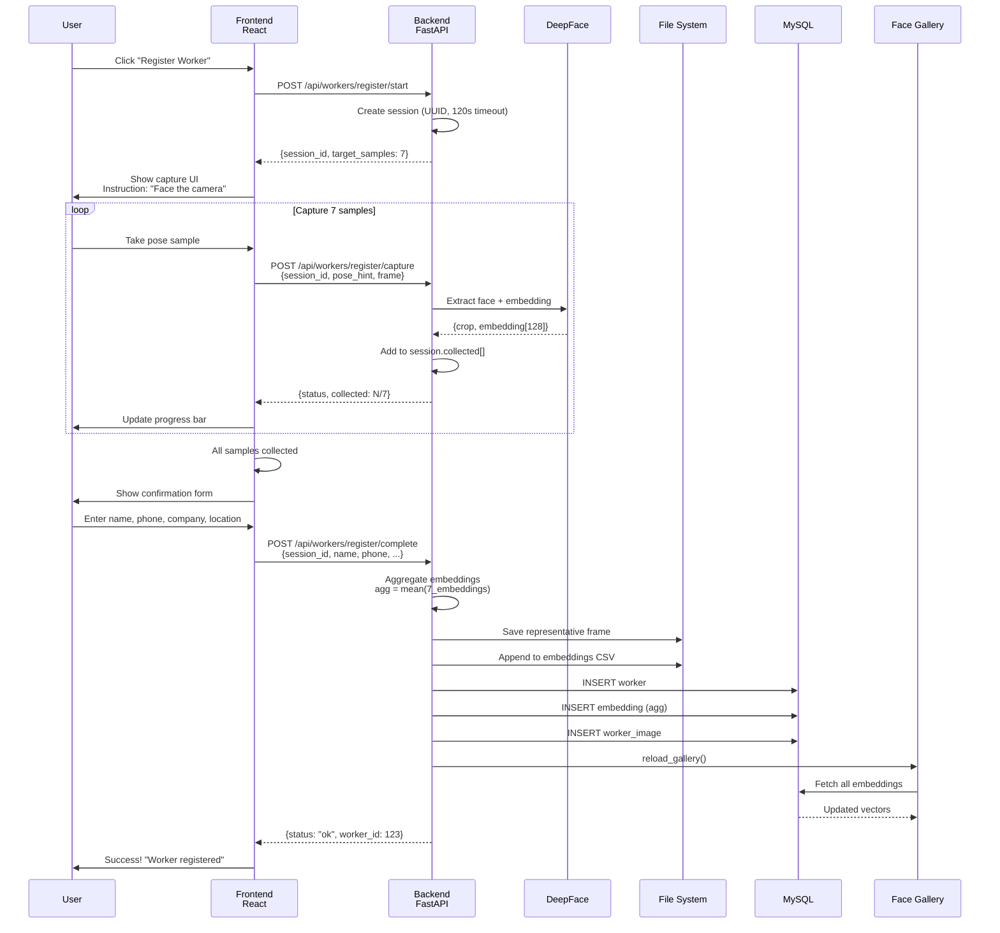
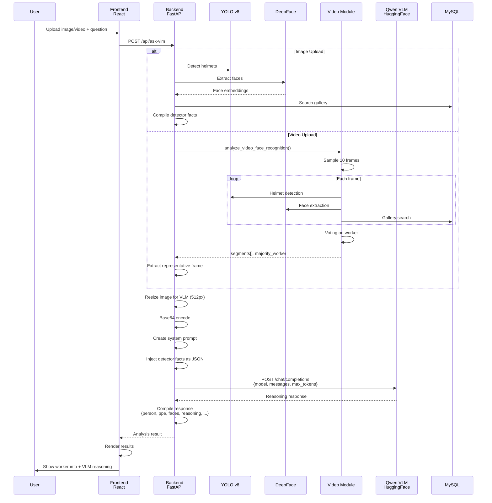
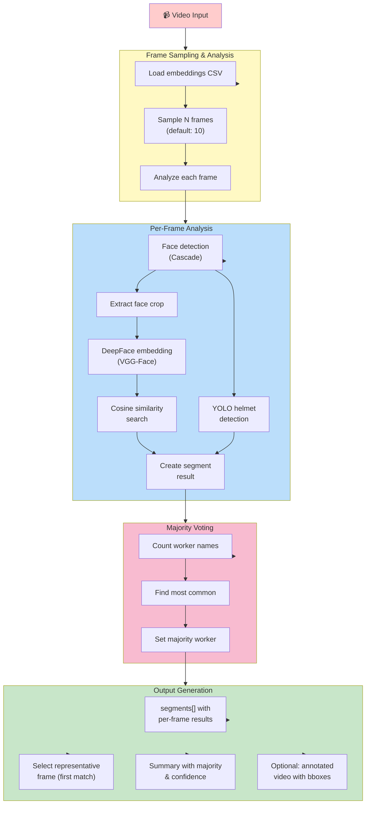
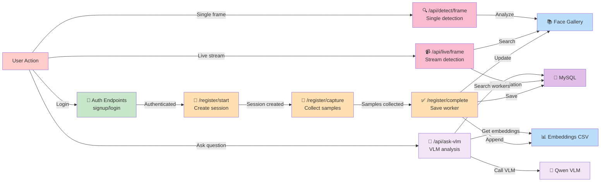
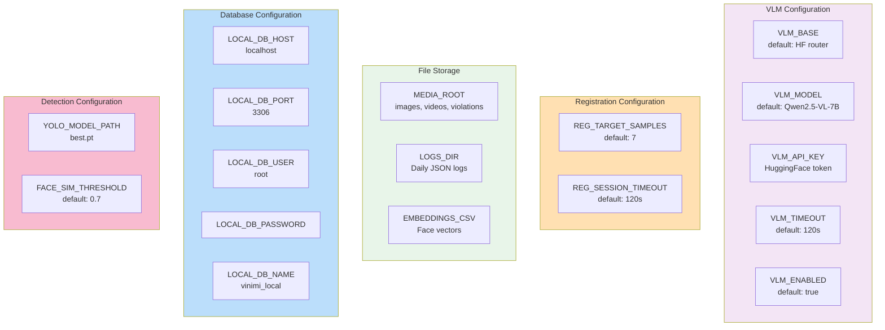
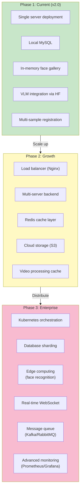

# VINIMI Architecture - Updated Mermaid Diagrams (v2.0+)

## System Architecture Diagram (Updated)



---

## Frontend Architecture - Updated Pages



---

## API Endpoint Map - Updated (25+ routes)



---

## Multi-Sample Registration Flow (NEW)



---

## VLM Analysis Workflow (NEW)



---

## Video Frame Analysis Detail (NEW)



---

## Endpoint Dependencies & Data Flow



---

## Configuration & Environment Variables (NEW)



---

## Registration Session Lifecycle (NEW)

```mermaid
stateDiagram-v2
    [*] --> Init: /register/start
    
    Init --> Collecting: Session created<br/>(session_id, 120s TTL)
    
    Collecting --> Collecting: /register/capture<br/>Face detected, sample added<br/>(collected < 7)
    
    Collecting --> ReadyComplete: Enough samples<br/>(collected >= 7)
    
    Collecting --> Timeout: 120s elapsed<br/>Session auto-deleted
    
    ReadyComplete --> Completed: /register/complete<br/>Form submitted
    
    Completed --> [*]: Worker saved<br/>Gallery updated
    
    Timeout --> [*]: Session expired
    
    note right of Collecting
        Max 7 samples
        One pose per capture
        Each sample: frame → face → embedding
    end
    
    note right of Completed
        1. Aggregate embeddings (mean)
        2. Save to CSV
        3. Save to MySQL (worker, embedding, image)
        4. Reload gallery
    end
```

---

## Technology Stack Update (v2.0+)

```mermaid
graph TB
    subgraph Frontend["FRONTEND<br/>React Stack"]
        React["⚛️ React 18"]
        Vite["⚡ Vite Bundler"]
        TS["📘 TypeScript"]
        Tailwind["🎨 Tailwind CSS"]
        ShadCN["🧩 shadcn/ui"]
        RQ["📊 React Query"]
        Framer["✨ Framer Motion"]
    end
    
    subgraph Backend["BACKEND<br/>Python Stack"]
        FastAPI["⚙️ FastAPI"]
        Uvicorn["🚀 Uvicorn"]
        Pydantic["✓ Pydantic"]
        YOLO["🔍 YOLO v8"]
        DeepFace["👤 DeepFace"]
        OpenCV["📷 OpenCV"]
        Twilio["📱 Twilio SDK"]
        Requests["🌐 Requests (VLM)"]
        Pandas["📊 Pandas (CSV)"]
    end
    
    subgraph AI["AI/ML MODELS"]
        YOLO_M["YOLO v8<br/>Object Detection"]
        VGG["VGG-Face<br/>Face Embeddings"]
        Cascade["Haar Cascade<br/>Face Detection"]
        Qwen["🤖 Qwen VLM<br/>Vision Language"]
    end
    
    subgraph Database["DATABASE<br/>Data Stack"]
        MySQL["🗄️ MySQL 8.x"]
        Redis["🔴 Redis (optional)"]
        CSV["📄 CSV Files<br/>(NEW)"]
    end
    
    subgraph DevOps["DEVOPS & EXTERNAL"]
        Docker["🐳 Docker"]
        HF["🤗 HuggingFace API<br/>(NEW)"]
        Twilio_API["Twilio API"]
    end
    
    Frontend --> React
    Frontend --> Vite
    Frontend --> TS
    Frontend --> Tailwind
    Frontend --> ShadCN
    Frontend --> RQ
    Frontend --> Framer
    
    Backend --> FastAPI
    Backend --> Uvicorn
    Backend --> Pydantic
    Backend --> YOLO
    Backend --> DeepFace
    Backend --> OpenCV
    Backend --> Twilio
    Backend --> Requests
    Backend --> Pandas
    
    AI --> YOLO_M
    AI --> VGG
    AI --> Cascade
    AI --> Qwen
    
    Database --> MySQL
    Database --> Redis
    Database --> CSV
    
    DevOps --> Docker
    DevOps --> HF
    DevOps --> Twilio_API
    
    style Frontend fill:#bbdefb
    style Backend fill:#fff9c4
    style AI fill:#f3e5f5
    style Database fill:#e1bee7
    style DevOps fill:#c8e6c9
```



---

## Performance & Scalability Roadmap



---

## Summary of Changes (v2.0+)

**New Components:**
✅ Registration Session Manager (in-memory with timeout)
✅ Multi-sample face embedding aggregation
✅ Video face recognition module with frame sampling
✅ VLM integration (Qwen via HuggingFace)
✅ CSV-based embedding persistence
✅ Image resizing for VLM optimization

**New Endpoints (5 added):**
- `/api/workers/register/start`
- `/api/workers/register/capture`
- `/api/workers/register/complete`
- `/api/ask-vlm`
- `/api/manager/signup` & `/api/manager/login` (alternatives)

**Enhanced Workflows:**
- Face detection now feeds into VLM reasoning
- Registration now collects multiple samples for better accuracy
- Video uploads analyzed with frame voting
- Detector facts (JSON) injected into VLM prompts
